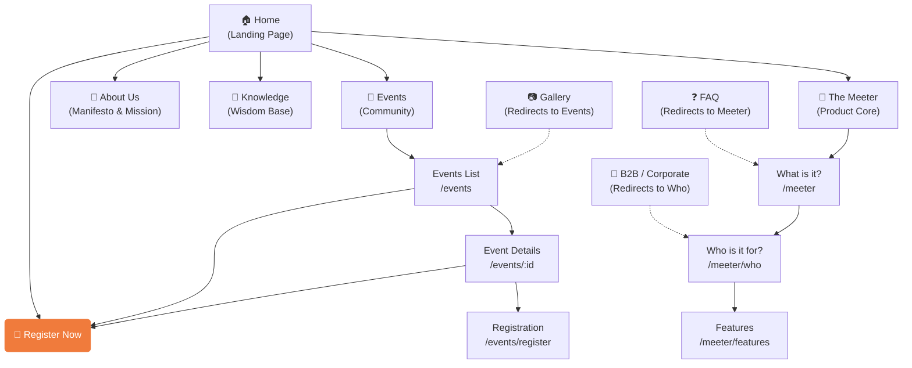

# The HBM - Visual Sitemap & User Flow

This document visualizes the structure of the new HBM website, showing how users navigate through the experience.

## 🗺️ Site Architecture Diagram

## 📑 Page Breakdown

### 1. **Core Experience (The Meeter)**
The heart of the new site, explaining the 8-minute connection engine.
*   **`/meeter` (What)**: The "Zero Small Talk" concept, the psychology, and the "Why".
*   **`/meeter/who` (Who)**: Targeted solutions for **Universities**, **Offices**, **Hotels**, etc. (The visual "Atmosphere" section).
*   **`/meeter/features` (How)**: The technical features (Matching, Prompts, Feedback).

### 2. **Community & Action (Events)**
Where users convert from visitors to participants.
*   **`/events`**: Visual calendar of upcoming and past events (Hero video interaction).
*   **`/events/:id`**: Specific event details, venue info, and specific agenda.
*   **`/events/register`**: The final conversion point to buy tickets/sign up.

### 3. **Wisdom (Knowledge)**
The educational pillar.
*   **`/knowledge`**: A library of books, articles, and figures that inspire the HBM philosophy.

### 4. **Brand (About)**
*   **`/about`**: The story, the team, and the "Human Being Movement" manifesto.

### 5. **Shortcuts & Redirects**
Quick links for marketing purposes:
*   `/b2b` → Goes to **Who Is It For?**
*   `/gallery` → Goes to **Events**
*   `/faq` → Goes to **The Meeter**
