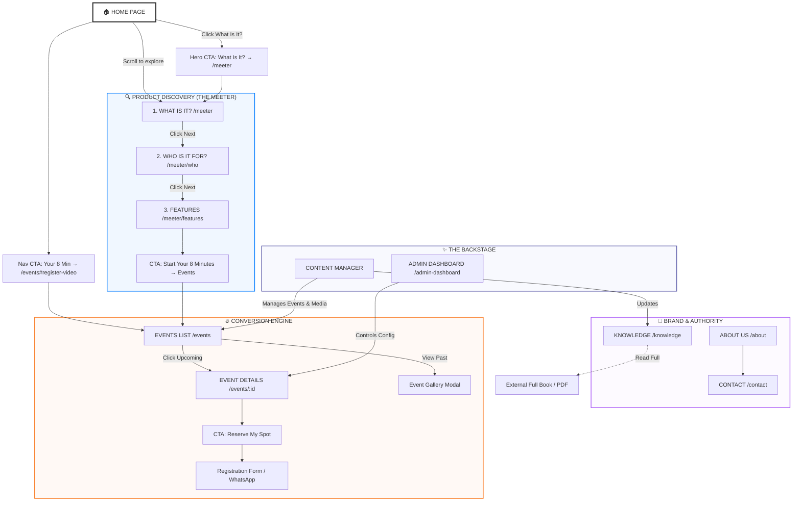

# 🗺️ Visual Sitemap & User Flow

High-level structure of the HBM site and how users move through it.

## 🗺️ Strategic Architecture Map (v8.0)

**Main flows & CTAs:**
- **Home** → Hero CTA "What Is It?" → `/meeter` · Nav CTA "Your 8 Min" → `/events#register-video` · Scroll to explore → Meeter section
- **Discovery:** What Is It? (`/meeter`) → Click Next → Who Is It For? (`/meeter/who`) → Click Next → Features (`/meeter/features`) → CTA "Start Your 8 Minutes" → **Events**
- **Events** (`/events`) → Click Upcoming → Event Details (`/events/:id`) → CTA "Reserve My Spot" → Registration Form / WhatsApp · Click Past → Event Gallery Modal
- **Trust:** Knowledge (`/knowledge`) → Read Full → External Book · About (`/about`) · Contact (`/contact`)

## 📑 Page Breakdown

### 1. **Core Experience (The Meeter)**
The heart of the new site, explaining the 8-minute connection engine.
*   **`/meeter` (What)**: The "Zero Small Talk" concept, the psychology, and the "Why".
*   **`/meeter/who` (Who)**: Targeted solutions for **Universities**, **Offices**, **Hotels**, etc. (The visual "Atmosphere" section).
*   **`/meeter/features` (How)**: The technical features (Matching, Prompts, Feedback).

### 2. **Community & Action (Events)**
Where users convert from visitors to participants.
*   **`/events`**: Visual calendar of upcoming and past events (Hero video interaction).
*   **`/events/:id`**: Specific event details, venue info, and specific agenda.
*   **`/events/register`**: The final conversion point to buy tickets/sign up.

### 3. **Wisdom (Knowledge)**
The educational pillar.
*   **`/knowledge`**: A library of books, articles, and figures that inspire the HBM philosophy.

### 4. **Brand (About)**
*   **`/about`**: The story, the team, and the "Human Being Movement" manifesto.

### 5. **Shortcuts & Redirects**
Quick links for marketing purposes:
*   `/b2b` → Goes to **Who Is It For?**
*   `/gallery` → Goes to **Events**
*   `/faq` → Goes to **The Meeter**

---

**See also:** [ARCHITECTURE.md](ARCHITECTURE.md) · [README](../README.md)
